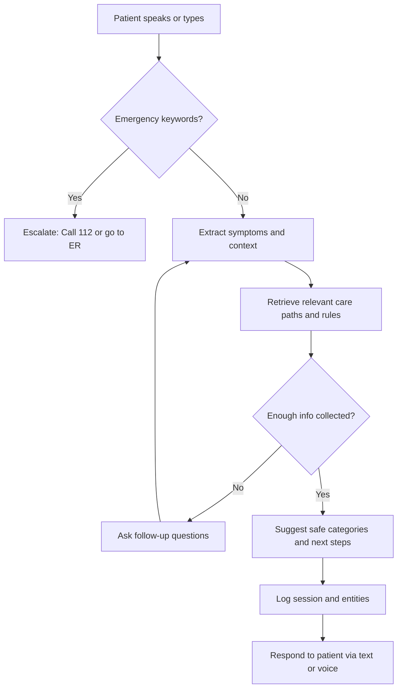
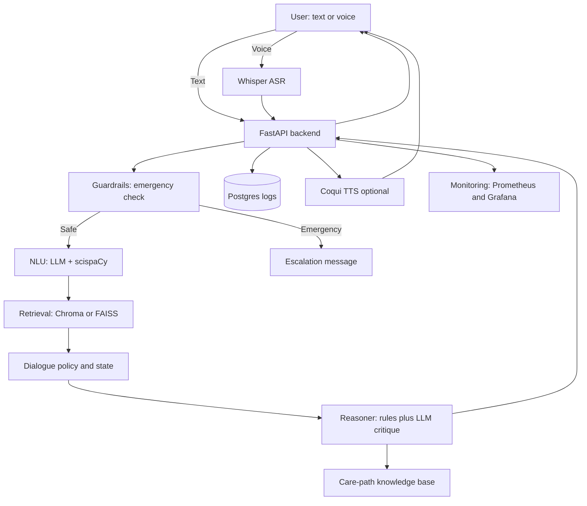

# Conversational AI for Patient Guidance (POC)

## Goal of this POC
This Proof of Concept (POC) explores how a conversational AI assistant can guide patients in describing their symptoms and receiving safe next-step advice.

**Important:**  
This is **not** a diagnostic tool. It is designed only for educational and triage-style guidance, with strict safety guardrails and disclaimers.

---

## Patient Experience (User-Facing Flow)

The assistant helps patients in 3 simple steps:
1. Tell your symptoms (via text or voice).  
2. The assistant asks follow-up questions and checks for emergencies.  
3. It provides safe categories (e.g., common cold vs allergy) and next steps (self-care, GP visit, urgent care).  

# Patient Flow: Conversational AI POC

This document explains how the assistant works from a **patient’s perspective**.

---

## Step-by-Step Narrative

1. **Start:** The patient types or speaks their symptoms.  
2. **Emergency check:** The system looks for severe red flags.  
   - If critical symptoms are found → escalate immediately (e.g., “Call 112 / go to ER”).  
3. **If safe:** The system extracts the symptoms and context (e.g., duration, severity, age).  
4. **Knowledge base:** It retrieves care-path rules relevant to the patient’s symptoms.  
5. **Follow-ups:** If more information is needed, the assistant asks targeted follow-up questions.  
6. **Decision:** Once enough information is collected, the assistant suggests:  
   - Safe categories (non-diagnostic, e.g., “cold vs allergy”), and  
   - Next steps (self-care, GP, urgent care).  
7. **Logging:** The session is logged for evaluation and improvement.  
8. **Output:** The patient receives a clear response in text (and optionally in voice).  

---

## Key Notes for Patients

- The assistant is **not a doctor**.  
- It provides **guidance only**, not diagnosis or prescriptions.  
- For emergencies, it always escalates to **call emergency services**.  
- For mild conditions, it helps decide if **self-care or a GP visit** is appropriate.  

# Developer Experience (Technical Flow)

# Developer Flow: Conversational AI POC

This document explains how the system processes input step by step from a developer’s perspective.

---

## Step-by-Step Narrative

1. **User input** (text or voice) enters the system.  
2. If **voice**, **Whisper ASR** transcribes it into text.  
3. The **FastAPI backend** orchestrates all steps.  

---

## Guardrails

- Run immediately after input is received.  
- If **emergency red flags** are detected → return an **escalation message** and stop.  
- If safe → continue processing.  

---

## NLU (Natural Language Understanding)

- Uses **LLM + scispaCy** to extract structured entities:  
  - Symptoms  
  - Duration  
  - Severity  
  - Risk factors  

---

## Retrieval

- Fetches relevant **care-path snippets** from a **vector store** (Chroma or FAISS).  

---

## Dialogue Policy

- Decides whether to:  
  - Ask additional follow-up questions, or  
  - Proceed to reasoning.  

---

## Reasoner

- Combines **NLU output** with the **knowledge base** and **triage rules**.  
- Produces **categories** (non-diagnostic) and **safe next steps**.  
- Includes an **LLM self-check** for safety and consistency.  

---

## Backend Logging & Monitoring

- **Logs** all sessions and extracted entities to **Postgres**.  
- Exposes system metrics (latency, red-flag counts, escalations) via **Prometheus/Grafana**.  

---

## Response

- Returns final guidance to the user:  
  - **Text** (always), and  
  - **Optional TTS** (via Coqui) for voice output.  

---

# Roadmap: Conversational AI for Patient Guidance (POC)

This roadmap outlines the phased development plan for building the proof of concept.

---

## 🛠 Sprint 0 – Project Skeleton (½ day)
- Initialize FastAPI project (`/chat` endpoint).  
- Add simple **SQLite/Postgres** database for session logging.  
- Create **Streamlit** or **Next.js** frontend with disclaimer banner.  
- Add emergency message placeholder (“🚨 Call 112 if this is an emergency”).  

---

## 🧠 Sprint 1 – Core Triage Loop (3–4 days)
- Integrate **LLM** (GPT-4o-mini or Llama 3.1).  
- Implement **entity extraction** with scispaCy + NegEx.  
- Build **red-flag ruleset** in `red_flags.py`.  
- Author **10–15 care-path snippets** (Markdown files).  
- Add **vector store (Chroma/FAISS)** for retrieval.  
- Implement **basic triage reasoning** (entities → snippets → categories + next step).  

---

## 🔒 Sprint 2 – Safety & Evaluation (3–4 days)
- Add **LLM critique step** for self-check safety.  
- Write **unit tests** for 20 synthetic scenarios (normal cases + red-flags).  
- Add **prompt regression tests** (Promptfoo / LangSmith).  
- Integrate **observability**:  
  - Latency tracking.  
  - % escalations.  
  - Conversation length.  

---

## 🎙 Sprint 3 – Voice & Demo Polish (3–4 days)
- Integrate **Whisper ASR** for speech-to-text.  
- Add **Coqui TTS** for speech output.  
- Create **session export** (Markdown or PDF summary).  
- Build **admin dashboard** to review logs.  
- Prepare **5 demo scripts** (e.g., chest pain, sore throat, child with fever).  

---

## 📦 Deliverables
- Functional **FastAPI backend** with triage loop.  
- **Frontend demo** (Streamlit or Next.js).  
- **Knowledge base** of care-path markdowns.  
- **Database + logging** of conversations.  
- **Monitoring dashboard** for safety metrics.  
- **Demo-ready scripts** for presentation.  

---

## ⏳ Timeline Overview
- Sprint 0 → Day 1  
- Sprint 1 → Days 2–5  
- Sprint 2 → Days 6–9  
- Sprint 3 → Days 10–13  

Total: ~2 weeks for a functional, safe POC.  

