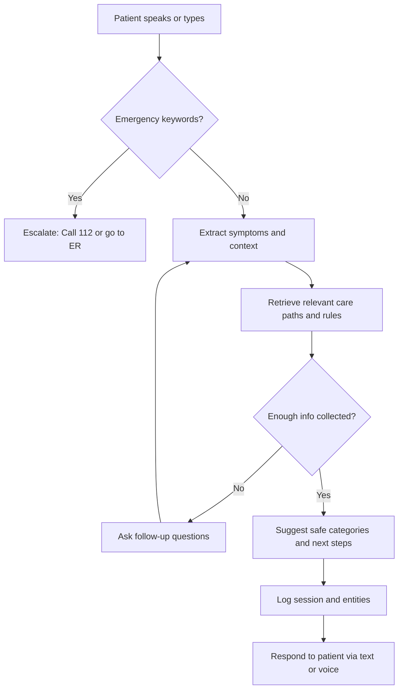
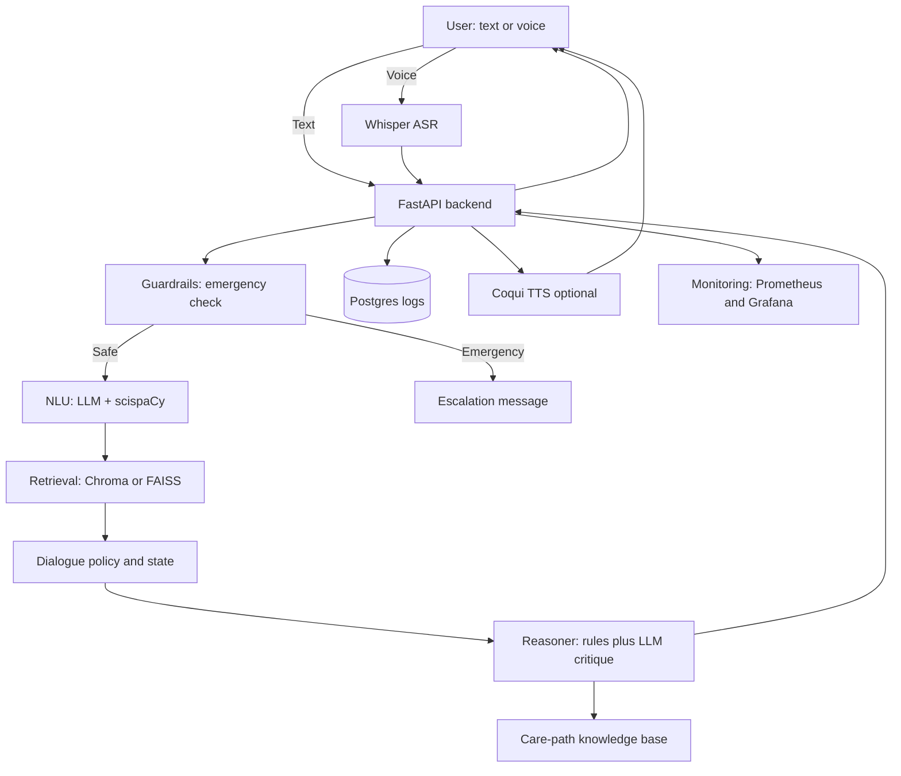
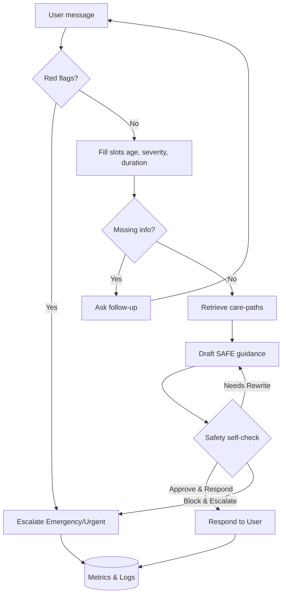

# Conversational AI for Patient Guidance (POC)

## Goal of this POC
This Proof of Concept (POC) explores how a conversational AI assistant can guide patients in describing their symptoms and receiving safe next-step advice.

**Important:**  
This is **not** a diagnostic tool. It is designed only for educational and triage-style guidance, with strict safety guardrails and disclaimers.

---

## Patient Experience (User-Facing Flow)

The assistant helps patients in 3 simple steps:
1. Tell your symptoms (via text or voice).  
2. The assistant asks follow-up questions and checks for emergencies.  
3. It provides safe categories (e.g., common cold vs allergy) and next steps (self-care, GP visit, urgent care).  


# Patient Flow: Conversational AI POC

This document explains how the assistant works from a **patient’s perspective**.

---

## Step-by-Step Narrative

1. **Start:** The patient types or speaks their symptoms.  
2. **Emergency check:** The system looks for severe red flags.  
   - If critical symptoms are found → escalate immediately (e.g., “Call 112 / go to ER”).  
3. **If safe:** The system extracts the symptoms and context (e.g., duration, severity, age).  
4. **Knowledge base:** It retrieves care-path rules relevant to the patient’s symptoms.  
5. **Follow-ups:** If more information is needed, the assistant asks targeted follow-up questions.  
6. **Decision:** Once enough information is collected, the assistant suggests:  
   - Safe categories (non-diagnostic, e.g., “cold vs allergy”), and  
   - Next steps (self-care, GP, urgent care).  
7. **Logging:** The session is logged for evaluation and improvement.  
8. **Output:** The patient receives a clear response in text (and optionally in voice).  

---

## Key Notes for Patients

- The assistant is **not a doctor**.  
- It provides **guidance only**, not diagnosis or prescriptions.  
- For emergencies, it always escalates to **call emergency services**.  
- For mild conditions, it helps decide if **self-care or a GP visit** is appropriate.  


# Developer Experience (Technical Flow)



# Developer Flow: Conversational AI POC

This document explains how the system processes input step by step from a developer’s perspective.

---

## Step-by-Step Narrative

1. **User input** (text or voice) enters the system.  
2. If **voice**, **Whisper ASR** transcribes it into text.  
3. The **FastAPI backend** orchestrates all steps.  

---

## Guardrails

- Run immediately after input is received.  
- If **emergency red flags** are detected → return an **escalation message** and stop.  
- If safe → continue processing.  

---

## NLU (Natural Language Understanding)

- Uses **LLM + scispaCy** to extract structured entities:  
  - Symptoms  
  - Duration  
  - Severity  
  - Risk factors  

---

## Retrieval

- Fetches relevant **care-path snippets** from a **vector store** (Chroma or FAISS).  

---

## Dialogue Policy

- Decides whether to:  
  - Ask additional follow-up questions, or  
  - Proceed to reasoning.  

---

## Reasoner

- Combines **NLU output** with the **knowledge base** and **triage rules**.  
- Produces **categories** (non-diagnostic) and **safe next steps**.  
- Includes an **LLM self-check** for safety and consistency.  

---

## Backend Logging & Monitoring

- **Logs** all sessions and extracted entities to **Postgres**.  
- Exposes system metrics (latency, red-flag counts, escalations) via **Prometheus/Grafana**.  

---

## Response

- Returns final guidance to the user:  
  - **Text** (always), and  
  - **Optional TTS** (via Coqui) for voice output.  

---


# Roadmap: Conversational AI for Patient Guidance (POC)

This roadmap outlines the phased development plan for building the proof of concept.

---

## 🛠 Sprint 0 – Project Skeleton (½ day)
- Initialize FastAPI project (`/chat` endpoint).  
- Add simple **SQLite/Postgres** database for session logging.  
- Create **Streamlit** or **Next.js** frontend with disclaimer banner.  
- Add emergency message placeholder (“🚨 Call 112 if this is an emergency”).  

---

## 🧠 Sprint 1 – Core Triage Loop (3–4 days)
- Integrate **LLM** (GPT-4o-mini or Llama 3.1).  
- Implement **entity extraction** with scispaCy + NegEx.  
- Build **red-flag ruleset** in `red_flags.py`.  
- Author **10–15 care-path snippets** (Markdown files).  
- Add **vector store (Chroma/FAISS)** for retrieval.  
- Implement **basic triage reasoning** (entities → snippets → categories + next step).  

---

## 🔒 Sprint 2 – Safety & Evaluation (3–4 days)
- Add **LLM critique step** for self-check safety.  
- Write **unit tests** for 20 synthetic scenarios (normal cases + red-flags).  
- Add **prompt regression tests** (Promptfoo / LangSmith).  
- Integrate **observability**:  
  - Latency tracking.  
  - % escalations.  
  - Conversation length.  

---

## 🎙 Sprint 3 – Voice & Demo Polish (3–4 days)
- Integrate **Whisper ASR** for speech-to-text.  
- Add **Coqui TTS** for speech output.  
- Create **session export** (Markdown or PDF summary).  
- Build **admin dashboard** to review logs.  
- Prepare **5 demo scripts** (e.g., chest pain, sore throat, child with fever).  

---

## 📦 Deliverables
- Functional **FastAPI backend** with triage loop.  
- **Frontend demo** (Streamlit or Next.js).  
- **Knowledge base** of care-path markdowns.  
- **Database + logging** of conversations.  
- **Monitoring dashboard** for safety metrics.  
- **Demo-ready scripts** for presentation.  

---

## ⏳ Timeline Overview
- Sprint 0 → Day 1  
- Sprint 1 → Days 2–5  
- Sprint 2 → Days 6–9  
- Sprint 3 → Days 10–13  

Total: ~2 weeks for a functional, safe POC.  


# Conversational Triage POC (Sprint 1)

**Goal:** a safe, *non-diagnostic* conversational assistant that guides patients to sensible next steps (self-care, GP, urgent care, or emergency escalation).  
**Policy (Sprint 1):**  
- **Strict Age:** always collect age before final guidance.  
- **Strict Severity:** always collect severity (mild/moderate/severe/worst) before final guidance.  
- **Guardrails first:** emergency/urgent patterns override everything.

> **Disclaimer (returned with every response):**  
> Educational guidance only; not medical advice; not for emergencies. If this is an emergency, call **112**.

---

## Quickstart

```bash
# (once)
python -m venv .venv
source .venv/bin/activate
pip install -r requirements.txt
python -m spacy download en_core_web_sm

# run api
uvicorn app.main:app --reload --port 8000
# docs: http://localhost:8000/docs
```
---
```bash
curl -s http://localhost:8000/health
# → {"status":"ok"}
```
### 1) Multi-turn (strict slots)
#### A) Typical URI (cough + sore throat)
```bash
# T1: symptoms → ASK (age)
curl -s 'http://localhost:8000/api/chat?session_id=s1' \
  -H 'content-type: application/json' \
  -d '{"message":"Dry cough and sore throat for 2 days, no fever"}' | jq

# T2: age → ASK (severity)
curl -s 'http://localhost:8000/api/chat?session_id=s1' \
  -H 'content-type: application/json' \
  -d '{"message":"35 years"}' | jq

# T3: severity → SAFE
curl -s 'http://localhost:8000/api/chat?session_id=s1' \
  -H 'content-type: application/json' \
  -d '{"message":"mild"}' | jq
```
#### Expect: ASK → ASK → SAFE (with categories, next_step, disclaimer).

#### B) All info in one turn → SAFE
```bash
curl -s 'http://localhost:8000/api/chat?session_id=s2' \
  -H 'content-type: application/json' \
  -d '{"message":"I am 30 years old, mild sore throat and dry cough for 2 days, no fever"}' | jq
# → SAFE
```

#### C) Out-of-order answers (agent should converge)
```bash
# T1: age only
curl -s 'http://localhost:8000/api/chat?session_id=s3' -H 'content-type: application/json' -d '{"message":"35 years"}' | jq

# T2: severity only
curl -s 'http://localhost:8000/api/chat?session_id=s3' -H 'content-type: application/json' -d '{"message":"moderate"}' | jq

# T3: symptoms with duration → SAFE
curl -s 'http://localhost:8000/api/chat?session_id=s3' -H 'content-type: application/json' -d '{"message":"Dry cough for 3 days, no fever"}' | jq
```
### 2) Guardrails (safety first)
```bash
# Emergency — chest pain + shortness of breath
curl -s 'http://localhost:8000/api/chat?session_id=e1' \
  -H 'content-type: application/json' \
  -d '{"message":"Crushing chest pain and shortness of breath"}' | jq
# → EMERGENCY (call 112)

# Urgent — UTI pattern with systemic signs
curl -s 'http://localhost:8000/api/chat?session_id=u1' \
  -H 'content-type: application/json' \
  -d '{"message":"Burning urination with fever and back pain"}' | jq
# → URGENT (or EMERGENCY depending on exact wording)

# Emergency — infant fever rule
curl -s 'http://localhost:8000/api/chat?session_id=p1' \
  -H 'content-type: application/json' \
  -d '{"message":"My 2 month old has a fever"}' | jq
# → EMERGENCY

# Emergency — pregnancy + severe abdominal pain
curl -s 'http://localhost:8000/api/chat?session_id=p2' \
  -H 'content-type: application/json' \
  -d '{"message":"I am pregnant and have severe abdominal pain"}' | jq
# → EMERGENCY
```
### 3) Retrieval breadth (categories should vary)
```bash
# Sore throat
curl -s 'http://localhost:8000/api/chat?session_id=kb1' \
  -H 'content-type: application/json' \
  -d '{"message":"I am 28 years old, mild sore throat for 2 days"}' | jq

# Headache
curl -s 'http://localhost:8000/api/chat?session_id=kb2' \
  -H 'content-type: application/json' \
  -d '{"message":"I am 40 years old, mild headache for 1 day"}' | jq

# Urinary symptoms
curl -s 'http://localhost:8000/api/chat?session_id=kb3' \
  -H 'content-type: application/json' \
  -d '{"message":"I am 33 years old, mild burning with urination for 1 day"}' | jq
```
### 4) Session isolation (no cross-talk)
```bash
# session A
curl -s 'http://localhost:8000/api/chat?session_id=isoA' -H 'content-type: application/json' \
  -d '{"message":"Dry cough for 2 days, no fever"}' | jq
# → ASK (age)

# session B (separate)
curl -s 'http://localhost:8000/api/chat?session_id=isoB' -H 'content-type: application/json' \
  -d '{"message":"Dry cough for 2 days, no fever"}' | jq
# → ASK (age) again

# continue session A
curl -s 'http://localhost:8000/api/chat?session_id=isoA' -H 'content-type: application/json' -d '{"message":"29 years"}' | jq
curl -s 'http://localhost:8000/api/chat?session_id=isoA' -H 'content-type: application/json' -d '{"message":"mild"}' | jq
# → SAFE
```
## Running the Smoke Tests (pytest)
```bash
pytest -q
# or
pytest tests/tests_flow.py -q
```
## Harmless to silence Chroma telemetry
```bash
export ANONYMIZED_TELEMETRY=false
export CHROMA_TELEMETRY_ENABLED=false
```
## ✅ Sprint 1 — “Done” Criteria

- [ ] **Multi-turn (strict age + strict severity)**
  - Flow: `symptoms → ASK (age) → ASK (severity) → SAFE` (same `session_id`).

- [ ] **Guardrails (safety-first)**
  - Chest pain + shortness of breath → **EMERGENCY**
  - UTI pattern + fever/back pain → **URGENT** *(or **EMERGENCY** if severe wording)*
  - Infant fever (< 3 months) → **EMERGENCY**

- [ ] **Retrieval breadth**
  - SAFE responses show **varied categories** aligned with the complaint (e.g., sore_throat, headache, urinary).

- [ ] **Response hygiene**
  - **Disclaimer** included in **every** response.

- [ ] *(Optional)* **Automated smoke tests**
  - `pytest -q` passes the four core tests.


---
## 🎯 Sprint 2 — Goals

1. **Safety Upgrade: LLM Self-Check**
   - Add a post-processing step that reviews each draft reply.
   - Outcomes: **APPROVE**, **REWRITE** to safer wording, or **BLOCK/ESCALATE** (ASK/URGENT/EMERGENCY).
   - Enforce: non-diagnostic language, no unsafe instructions, disclaimer present, no conflict with red flags.

2. **Robustness & Signal Quality**
   - **Duration parsing**: extract/normalize (hours/days/weeks → `duration_days`).
   - **Severity normalization**: map synonyms → {mild, moderate, severe, worst}.
   - **Red-flag expansion**: pediatrics, pregnancy, neuro (worst headache, focal deficits), allergy/anaphylaxis, mental-health crisis, poisoning/overdose, trauma.

3. **Observability**
   - **/metrics** (Prometheus): request count, status breakdown (ASK/SAFE/URGENT/EMERGENCY), safety outcomes (approved/rewritten/blocked), error count, latency histogram.
   - **Structured logs** (JSON, no PII): `ts`, `request_id`, `session_id`, `status`, `elapsed_ms`, `asked_slots`.

4. **Reliability & UX Polish**
   - Conservative **fallbacks** if retrieval or safety check fails (fail safe to ASK or URGENT; never crash).
   - Ensure **disclaimer** and non-diagnostic phrasing are always present.

### Architecture changes (conceptual)

#### Key insertions:
1. SCheck: a post-processor that reviews the draft reply (not chain-of-thought) for: diagnostic claims, unsafe instructions, missing disclaimer, hallucinated certainty. 
2. Slots: now includes duration_days and normalized severity.

## 📐 Behavioral Specs

This section defines how the system **should behave** in Sprint 2. It’s implementation-agnostic and drives tests.

---

### 1) LLM Safety Self-Check

**Placement:** After the draft reply is composed (by rules/retrieval), before returning to the user.

**Input:**
- `draft`: `{status, reply, categories?, next_step?, rationale?, disclaimer?}`
- `context`: `{red_flags_seen: bool, asked_slots: {age,severity,duration}, retrieval_hits: int, session_id, request_id}`

**Policy checks (must all pass):**
- **Non-diagnostic language:** No definitive claims (e.g., *“you have pneumonia”*). Prefer *“could be consistent with common viral causes”*.
- **No unsafe instructions:** No prescriptions, no dosing specifics beyond *“per label”*, no off-label drug names.
- **Consistency with red flags:** If emergency/urgent conditions present, **must** escalate; SAFE replies must not downplay red flags.
- **Disclaimer present:** Always include the standard disclaimer.
- **No hallucinated certainty:** Avoid absolute terms (*“definitely”*, *“guaranteed”*).

**Actions:**
- `APPROVE`: Pass draft unchanged.
- `REWRITE`: Return a **safer paraphrase** (preserve `status` and `next_step` intent).
- `BLOCK/ESCALATE`: Replace with `ASK` or `URGENT/EMERGENCY` and a brief reason.

**Fail-safe:**
- If the self-check fails/times out, return a **conservative** version of the draft with reinforced caution and log `safety_check_failure = 1`.

**Interface (concept):**
```json
{
  "action": "APPROVE | REWRITE | BLOCK",
  "text": "optional new reply when REWRITE/BLOCK",
  "reason": "short machine-readable reason"
}
```
---

# Monitoring Verification

## Verify Prometheus is scraping:

Open http://localhost:9090/targets
 → triage_api should be UP

Try a query at http://localhost:9090/graph
, e.g. triage_requests_total

## Open Grafana:

http://localhost:3000
 (login: admin / admin)

Go to Dashboards → New → New dashboard → Add visualization

Select Prometheus as the datasource.

---
# Sprint 2 — Safety, Robustness & Observability (Implementation Steps)

This stage adds an **LLM safety self-check** (opt-in), improves **slotting** (duration), and wires **metrics + logs** so you can observe behavior. Follow these steps in order.

---
